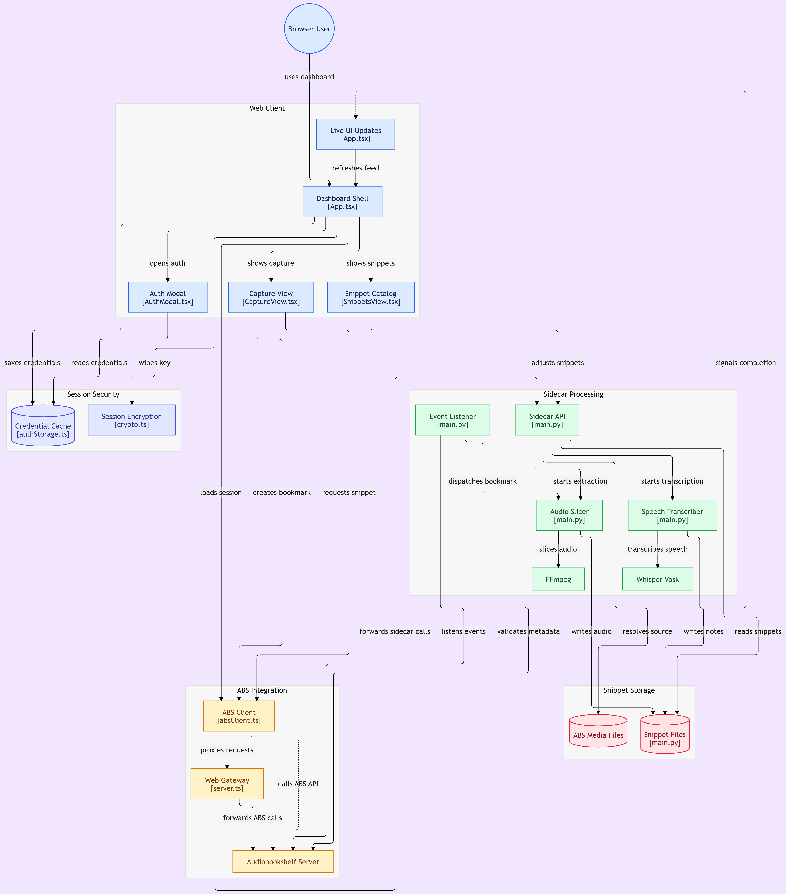
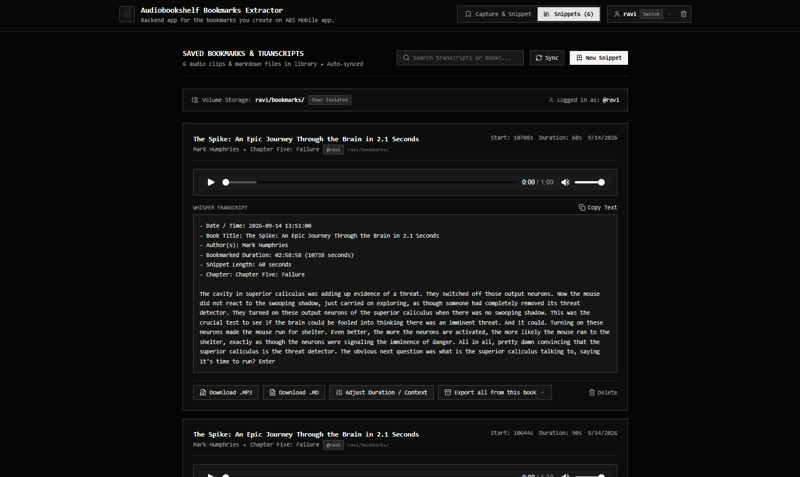

# Audiobookshelf Bookmarks Manager

**Version 2.1.0 (Event-Driven Architecture)**  
Autonomous bookmark audio clipper, Whisper speech-to-text transcriber, and web dashboard for [Audiobookshelf](https://www.audiobookshelf.org/).

GitHub: [https://github.com/raviwarrier/audiobookshelf-bookmarks-manager](https://github.com/raviwarrier/audiobookshelf-bookmarks-manager)

---

## What It Does

**Audiobookshelf Bookmarks Manager** automatically extracts audio clips corresponding to your bookmarks or listening positions in Audiobookshelf, transcribes them into searchable notes using AI speech recognition (`faster-whisper` or `Vosk`), and neatly organizes the resulting `.mp3`, `.md`, and `.json` files per user (`{VOLUME_DIR}/{username}/bookmarks/{book_title}/`).

### Key Capabilities

- 🎧 **Native ABS Client Compatibility**: Zero companion apps or modified clients required. Keep using the official Audiobookshelf mobile apps (iOS & Android) and web browser client directly.
- ⚡ **Zero-Proxy Architecture**: Your Audiobookshelf clients connect directly to Audiobookshelf. No traffic is intercepted or routed through an intermediate proxy, eliminating WebSocket dropouts, socket disconnect toasts, and gateway latency.
- 📡 **Real-Time Event Listener**: The Python sidecar connects directly to Audiobookshelf's WebSocket (`AbsSocketIoListener`) as a passive listener. Tapping "Bookmark" in your mobile app triggers clipping within seconds.
- 🔄 **Non-Blocking Background Sync**: Background sync cycles run concurrently without holding open HTTP requests or causing proxy timeouts. Real-time progress updates are reported directly to the UI.
- 📁 **Resilient Audio Extraction**: Slices audio locally from `.m4b`/`.mp3` files via `ffmpeg` with `PATH_MAPPINGS` support and multi-track offset resolution. If a local file is unmounted or moved, it seamlessly falls back to streaming and extracting audio directly from the Audiobookshelf server over HTTP.
- 🔁 **One-Click Snippet Retry**: If audio extraction previously failed due to network hiccups or unmounted drives, retry snipping and transcription with a single click right from the snippet card.
- ⏱️ **Adjust & Re-Clip Context**: Expand pre-roll or total duration on any snippet directly in the UI to capture surrounding discussion while preserving original bookmark anchors.
- 📅 **Configurable Cutoff Dates**: Exclude historical bookmarks prior to installation or customize the cutoff date (from installation, from server beginning, or a custom `YYYY/MM/DD` date).
- 🎙️ **Resource-Optimized AI Transcription**: Powered by `faster-whisper` with bounded CPU threads (`WHISPER_THREADS`) and low process priority (`os.nice(15)`), keeping Raspberry Pi and home servers snappy.
- 📚 **Book Filtering & Unique Book Counts**: Filter snippets by typing book titles or selecting from the dropdown. The "All Books" button dynamically displays the count of unique books in your library.
- 📦 **Per-Book Bulk Export**: Download all bookmarks for any audiobook as a complete **ZIP package** (all audio MP3s + individual MD notes) or a **consolidated Markdown digest** ready for Obsidian, Logseq, or Notion.
- 🔒 **Zero-Disk Ephemeral Security**: Client credentials and API tokens are kept in memory using ephemeral AES-256 session encryption and are never written to disk, cookies, or browser databases.

---

## Architecture



### Component Overview

```
[ Mobile App / Web Client ] ─────────────► [ Audiobookshelf Server (Port 13378) ]
                                                          ▲
                                                          │ (WebSocket & REST API)
                                                          ▼
                                              [ abs-manager-sidecar (Port 13380) ]
                                              - Real-Time Socket.IO Listener
                                              - Background Sync Daemon (Async)
                                              - FFmpeg Audio Slicer (Local Disk / HTTP Stream)
                                              - faster-whisper Speech-to-Text Engine
                                              - Saves .mp3, .md, .json to VOLUME_DIR
                                                          ▲
                                                          │ (Media Streaming & REST)
                                                          ▼
                                              [ abs-manager-web (Port 13379) ]
                                              - React 19 SPA Dashboard
                                              - Audio Player with Range-Header Seeking
                                              - Live Filter, Search, Retry & Adjust Modals
                                              - Book ZIP & Markdown Exporters
```

1. **Audiobookshelf Server (Port 13378)**: Your primary media server. Official mobile apps and browser clients connect directly without middleman proxies.
2. **abs-manager-sidecar (Port 13380)**: Python FastAPI service. Operates as an event-driven background daemon that listens for bookmark events, slices audio, transcribes speech, and handles bookmark metadata.
3. **abs-manager-web (Port 13379)**: Node.js/Express server and React SPA. Provides the web dashboard, proxies requests to bypass browser CORS restrictions, and streams media directly to the browser player.

---

## Screenshots

### Main Screen (Active Listening & Instant Capture)


### Snippets View (Search, Playback, Filter & Export)


---

## Quick Reference: Ports & Services

| Service Name | Default Port | Variable Name(s) | Typical Address | Purpose |
| :--- | :--- | :--- | :--- | :--- |
| **Audiobookshelf Server** | **`13378`** | `ABS_TARGET_SERVER`<br>`ABS_SERVER_URL` | `http://192.168.1.100:13378` | Your media server. Apps connect here directly. |
| **Sidecar & Event Listener** | **`13380`** | `SIDECAR_PORT`<br>`SIDECAR_URL` | `http://192.168.1.100:13380` | Passive WebSocket listener, audio slicer, Whisper STT. |
| **Web Dashboard** | **`13379`** | `PORT: 13379` | `http://192.168.1.100:13379` | Browser interface for browsing, listening, and exporting. |

> **Note on Docker Host Networking:**  
> If Audiobookshelf is running inside a Docker container, set `ABS_TARGET_SERVER` to your server's LAN IP (e.g. `http://192.168.1.100:13378`) rather than `localhost` to allow inter-container and host communication.

---

## Prerequisites

- **Audiobookshelf Server** (v2.0+) up and running.
- **Audio Files Access**: Direct local directory access or Docker volume mount to source audiobook media files for local lossless slicing (optional: HTTP streaming fallback will be used if files are unmounted).
- **Node.js**: `v18.0.0` or higher (with `npm`).
- **Python**: `v3.10` or higher (with `pip` and `venv`).
- **FFmpeg**: Mandatory system tool for audio slicing and extraction:
  - *Ubuntu / Debian*: `sudo apt-get install -y ffmpeg`
  - *macOS (Homebrew)*: `brew install ffmpeg`
  - *Arch Linux*: `sudo pacman -S ffmpeg`
  - *Fedora / RHEL*: `sudo dnf install -y ffmpeg`

---

## Installation & Setup

### Method 1: PM2 (Recommended for Linux / Raspberry Pi)

The project includes an `ecosystem.config.cjs` ready for production management via PM2:

```bash
# 1. Clone repository
git clone https://github.com/raviwarrier/audiobookshelf-bookmarks-manager.git
cd audiobookshelf-bookmarks-manager

# 2. Run the automated installer
# (Sets up Python venv, installs dependencies, verifies FFmpeg, and builds the frontend bundle)
./update.sh

# 3. Configure environment settings
./setup.sh

# 4. Start services with PM2
pm2 start ecosystem.config.cjs
pm2 save
```

### Method 2: Docker Compose

```bash
git clone https://github.com/raviwarrier/audiobookshelf-bookmarks-manager.git
cd audiobookshelf-bookmarks-manager

# Configure settings
./setup.sh

# Launch containers
docker compose up -d --build
```

---

## Interactive Setup Wizard & Updating

### Setup Wizard (`./setup.sh`)
Run `./setup.sh` (or `python3 setup.py`) anytime to interactively configure:
1. Audiobookshelf Target Server URL
2. Bookmarks storage directory (`VOLUME_DIR`)
3. Audiobook media files directory (`AUDIOBOOKS_PATH`)
4. Container-to-host path mappings (`PATH_MAPPINGS`)
5. Web dashboard port (`13379`) & Sidecar port (`13380`)
6. Whisper model size (`tiny.en`, `base.en`, `small.en`, `medium.en`)

### One-Command Updater (`./update.sh`)
To pull updates and rebuild without downtime:
```bash
git pull origin main
./update.sh
```
The updater automatically pulls dependency updates, recompiles the TypeScript/Express bundle (`dist/server.cjs`), and gracefully restarts PM2 processes.

---

## Configuration & Environment Variables

All settings can be placed in `.env`, `docker-compose.yml`, or `ecosystem.config.cjs`:

| Variable | Default Value | Description |
| :--- | :--- | :--- |
| `ABS_TARGET_SERVER` | `http://localhost:13378` | LAN or HTTP URL of your Audiobookshelf server. |
| `ABS_SERVER_URL` | `http://localhost:13378` | Fallback alias for `ABS_TARGET_SERVER`. |
| `PORT` | `13379` | Port for the Web Dashboard and Express proxy server. |
| `SIDECAR_PORT` | `13380` | Port for the Python FastAPI sidecar. |
| `SIDECAR_URL` | `http://localhost:13380` | URL used by the web server to communicate with the sidecar. |
| `VOLUME_DIR` | `/data` | Output root directory where `.mp3`, `.md`, and `.json` files are saved. |
| `AUDIOBOOKS_PATH` | `/audiobooks` | Host server path where audiobook files are located. |
| `PATH_MAPPINGS` | *None* | Comma-separated pairs mapping container paths to host paths (e.g. `/audiobooks:/srv/ssd/Bookshelf/Audiobooks`). |
| `BOOKMARK_SYNC_INTERVAL` | `120` | Interval (in seconds) for the background sync safety check. |
| `INTERCEPT_SNIPPET_DURATION` | `60` | Total length (seconds) for audio clips extracted from mobile bookmarks. |
| `INTERCEPT_PRE_ROLL` | `30` | Seconds captured prior to the bookmark timestamp. |
| `SNIPPET_DURATION` | `60` | Default duration (seconds) for manual snippet capture in Web UI. |
| `SNIPPET_PRE_ROLL` | `30` | Default pre-roll (seconds) for manual snippet capture in Web UI. |
| `WHISPER_MODEL` | `base.en` | Model size for faster-whisper (`tiny.en`, `base.en`, `small.en`, `medium.en`). |
| `WHISPER_THREADS` | `2` | CPU thread allocation for Whisper (protects low-power CPUs). |
| `PREWARM_WHISPER` | `false` | When `false`, loads Whisper on-demand to conserve RAM. |
| `USE_BACKEND_PROXY` | `true` | Bypasses browser CORS restrictions by proxying API calls through the web server. |

---

## REST API Reference

The FastAPI sidecar and Express proxy expose endpoints for automation, custom scripts, and integrations:

### 1. Health & Status
```bash
# Sidecar health check
curl -X GET http://localhost:13380/api/health

# Background sync & socket listener status
curl -X GET http://localhost:13380/api/user/sync-status
```

### 2. Trigger Bookmark Sync
```bash
# Triggers an immediate asynchronous background sync (returns immediately without timing out)
curl -X POST http://localhost:13380/api/user/sync-bookmarks \
  -H "Authorization: Bearer <ABS_API_TOKEN>"

# Optional: Wait synchronously for full sync to finish
curl -X POST "http://localhost:13380/api/user/sync-bookmarks?wait=true" \
  -H "Authorization: Bearer <ABS_API_TOKEN>"
```

### 3. Cutoff Date Configuration
```bash
# Get current cutoff configuration
curl -X GET http://localhost:13380/api/cutoff-config \
  -H "Authorization: Bearer <ABS_API_TOKEN>"

# Update cutoff mode: "from_now" (installation date), "from_start", or "custom_date"
curl -X POST http://localhost:13380/api/cutoff-config \
  -H "Authorization: Bearer <ABS_API_TOKEN>" \
  -H "Content-Type: application/json" \
  -d '{"mode": "custom_date", "custom_date": "2026-01-01"}'
```

### 4. Create or Adjust Snippet
```bash
# Extract active playback snippet
curl -X POST http://localhost:13380/api/snippet \
  -H "Authorization: Bearer <ABS_API_TOKEN>" \
  -H "Content-Type: application/json" \
  -d '{"duration": 60, "pre_roll": 30}'

# Adjust duration/pre-roll or retry extraction
curl -X POST http://localhost:13380/api/snippet/expand \
  -H "Authorization: Bearer <ABS_API_TOKEN>" \
  -H "Content-Type: application/json" \
  -d '{"snippet_id": "20260910_103000", "pre_roll": 45, "duration": 90}'
```

### 5. List & Export Bookmarks
```bash
# List all bookmarks for the authenticated user
curl -X GET http://localhost:13380/api/user/bookmarks \
  -H "Authorization: Bearer <ABS_API_TOKEN>"

# Download complete ZIP archive (Audio clips + Markdown notes)
curl -O -J -L "http://localhost:13380/api/export-book?book_title=Project%20Hail%20Mary&format=zip" \
  -H "Authorization: Bearer <ABS_API_TOKEN>"

# Download consolidated Markdown document
curl -O -J -L "http://localhost:13380/api/export-book?book_title=Project%20Hail%20Mary&format=markdown" \
  -H "Authorization: Bearer <ABS_API_TOKEN>"
```

---

## License (MIT in Plain English)

You are free to use, copy, modify, merge, publish, distribute, and sell copies of this software for personal, educational, or commercial purposes.

Conditions:
1. Retain the original copyright notice and permission notice in any distributed copies.
2. The software is provided as-is, without warranty of any kind. Authors and contributors are not liable for any issues arising from its use.
